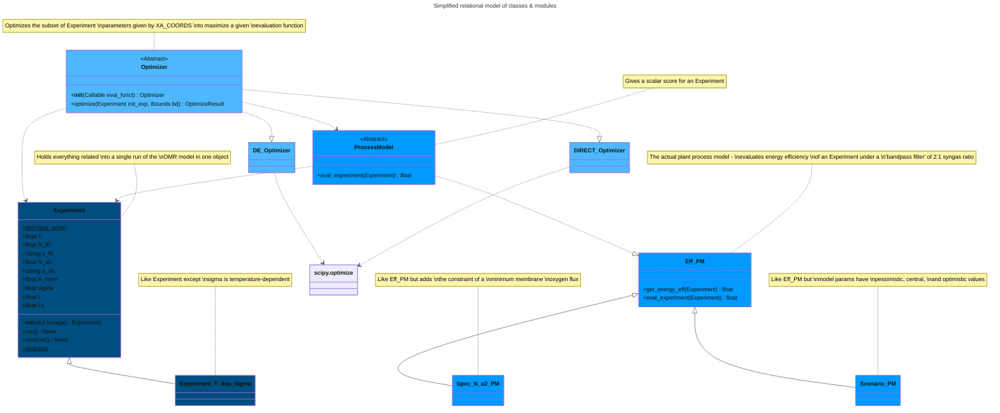

Prerequisites
--
- Numpy
- SciPy
- Cantera (tested with version 2.6.0)
- Matplotlib
- Pint
- xarray

Description
--
This is a collection of libraries using Kai Bittner's OMR model (see parent of this fork) to integrate the OMR model into a plant process model, optimize the operating point of an OMR, and visualize OMR data.

Modules and contents:
- `experiment.py`: object-oriented encapsulation for evaluation with the OMR model
- `process_model.py`: process model of an OMR plant
- `optimization.py`: optimization of an OMR plant's operating point
- `plotting.py`: some ways to visualize data from the OMR and plant process models
- `matplotlibrc`: optional runtime constants of matplotlib library
- `profiling.py`: starter script to profile optimization
- `OMR_Model_multiprc.py`: multiprocessing rework of OMR_Model
- `OMR_Model_lim.py`: fork of OMR_Model using the thermodynamic limit of infinite conductivity instead of user-specified conductivity
- `OMR_Model_profile.py`: fork of OMR_Model with more internal functions for more detailed profiling

